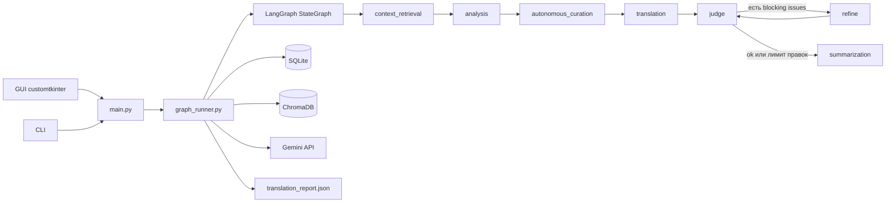
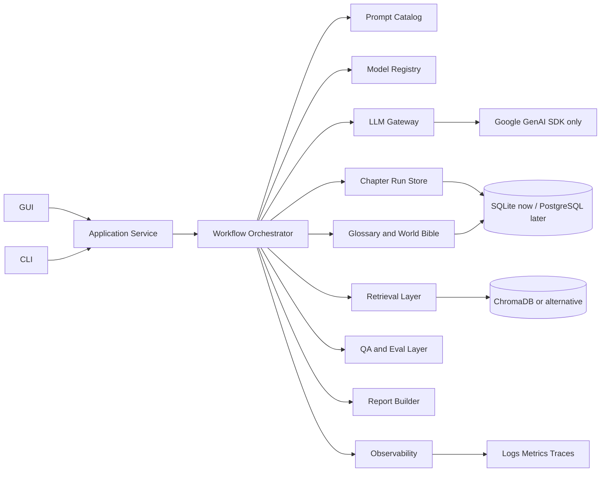

# Анализ репозитория Perevod и путь к идеальному переводу и автоматизации

## Executive summary

`sunil123456897/Perevod` уже выглядит как не «игрушка», а как локальный desktop-first инструмент для пакетного перевода новелл: у него есть GUI на `customtkinter`, CLI-режим, LangGraph-воркфлоу, SQLite для структурных данных, ChromaDB для базы знаний, кэш переводов, кэш эмбеддингов, атомарная запись файлов, lock на output-каталог, машинный `translation_report.json`, режим `doctor` и набор автотестов. Это хорошая база: проект уже умеет не просто «вызвать LLM», а вести словарь, повторный запуск, QA-проверку и rolling memory. fileciteturn26file0L3-L3 fileciteturn27file0L3-L3 fileciteturn28file0L3-L3 fileciteturn37file0L3-L3 fileciteturn40file0L3-L3 fileciteturn41file0L3-L3 fileciteturn45file0L3-L3 fileciteturn49file0L3-L3

Главные слабые места сейчас не в «идее», а в инженерной обвязке и в устойчивости translation pipeline. Самые заметные разрывы: слоистость архитектуры неполная; `main.py` и GUI знают слишком много о workflow; упаковка и metadata в `pyproject.toml` оформлены некорректно; зависимости не зафиксированы lock-файлом; одновременно заявлены новый `google-genai` и устаревший `google-generativeai`; в коде жёстко прошиты preview-модели Gemini; локальный бюджет-трекер расходится с реальной моделью квот Gemini; миграций БД нет; CI минимален; security automation почти отсутствует; README частично устарел относительно changelog и текущего кода. fileciteturn68file0L3-L3 fileciteturn75file0L3-L3 fileciteturn30file0L3-L3 fileciteturn39file0L3-L3 fileciteturn69file0L3-L3 fileciteturn70file0L3-L3 fileciteturn72file0L3-L3

Если доводить проект до современного, почти «идеального» состояния, я бы **не начинал с дорогой полной переработки в микросервисы**. Оптимальная траектория для этого репозитория — сначала превратить его в **hardened local product**: один официальный Google GenAI SDK, корректный packaging, lockfile, миграции, нормальный CI, coverage, CodeQL/Dependabot/secret scanning/SBOM/SECURITY.md, более чистое разделение UI и application layer, token-aware orchestration и наблюдаемость. Уже после этого можно решать, нужен ли второй этап с API-сервисом и очередью задач. Такой путь лучше соответствует и текущему коду, и собственному blueprint-документу проекта. fileciteturn25file0L3-L3 citeturn2view0turn3view1turn3view3turn3view4turn4view0turn3view5turn8view4turn8view5turn11view3turn16view5turn9view0turn7view0turn5view3turn16view0turn16view2

## Что уже есть

По факту проект построен вокруг одного LangGraph-графа: `context_retrieval -> analysis -> autonomous_curation -> translation -> judge -> refine? -> summarization`, а GUI и CLI лишь инициируют этот flow. Хранилища разделены на SQLite для project settings / glossary / cache и ChromaDB для knowledge base. Выход воркфлоу фиксируется в отчёте, а файлы и отчёт пишутся атомарно. Это уже гораздо лучше типичного однопромптового «переводчика на коленке». fileciteturn28file0L3-L3 fileciteturn32file0L3-L3 fileciteturn36file0L3-L3 fileciteturn37file0L3-L3 fileciteturn40file0L3-L3 fileciteturn41file0L3-L3



Из сильных сторон отдельно отмечу то, что в проекте уже есть: защита от параллельного запуска в один output-каталог через `.translation.lock`, повторный запуск по статусам из `translation_report.json`, кэш переводов, отдельный `doctor` для диагностики окружения, проверка небезопасных имён проектов и даже тест на импортные границы, чтобы `ProjectManager` не тянул `chromadb` раньше времени. Это всё признаки зрелости мышления, даже если реализация ещё не доведена до production-grade. fileciteturn28file0L3-L3 fileciteturn43file0L3-L3 fileciteturn45file0L3-L3 fileciteturn47file0L3-L3 fileciteturn50file0L3-L3

История, доступная через GitHub connector, выглядит очень короткой и молодой: в ней, по крайней мере, видны коммиты `Initial clean project snapshot` и `Clean ignored local artifacts`, оба от 2026-05-15. Это означает, что проект сейчас находится в фазе быстрой стабилизации, а не в фазе многолетней поддержки. Отсюда и дисбаланс: много полезной логики появилось быстрее, чем вокруг неё сформировались «скучные», но обязательные инженерные практики. fileciteturn57file0L3-L3 fileciteturn64file0L3-L3

Ниже — компактная карта зрелости по ключевым атрибутам.

| Атрибут | Текущее состояние | Итог |
|---|---|---|
| Архитектура | LangGraph-оркестрация уже есть, но entrypoint и GUI всё ещё тесно связаны с бизнес-логикой. fileciteturn26file0L3-L3 fileciteturn28file0L3-L3 fileciteturn48file0L3-L3 | Средне |
| Структура каталогов | Есть `src`, `tests`, `scripts`, `docs`, `.github/workflows`, но сохраняются transitional entrypoints вроде `run.py` и `start.bat`. fileciteturn74file0L3-L3 fileciteturn60file0L3-L3 fileciteturn69file0L3-L3 | Средне |
| Зависимости | `pyproject.toml` неполирован: placeholder metadata, неверное место для `classifiers`, нет lockfile, есть дублирование SDK. fileciteturn68file0L3-L3 | Слабо |
| Тесты | Safe-suite охватывает 18 тестовых модулей, но процент покрытия не указан. fileciteturn49file0L3-L3 | Средне |
| CI/CD | Один job, одна ОС, одна версия Python, без coverage/security stages. fileciteturn69file0L3-L3 | Слабо |
| Безопасность | Есть `.env.example`, `.gitignore`, базовая валидация, но нет оформленного security surface и automation. fileciteturn58file0L3-L3 fileciteturn59file0L3-L3 fileciteturn47file0L3-L3 | Слабо |
| Производительность | Есть кэш, но workflow работает по главам целиком, без token-budget planning и без нормальной concurrency-модели. fileciteturn32file0L3-L3 fileciteturn43file0L3-L3 | Средне/слабо |
| Локализация и UX | Пользовательский слой русскоязычный, промпты и часть внутренних сообщений англоязычные; API-слоя нет. fileciteturn26file0L3-L3 fileciteturn27file0L3-L3 fileciteturn32file0L3-L3 fileciteturn48file0L3-L3 | Средне |
| Документация | README подробный, но уже расходится с changelog и текущим состоянием. fileciteturn70file0L3-L3 fileciteturn72file0L3-L3 | Средне/слабо |
| Миграции, контейнеризация, деплой | Миграций нет, контейнеризация/деплой не указаны. `create_all()` вызывается рантаймом. fileciteturn39file0L3-L3 | Слабо / не указано |
| Мониторинг и логирование | Есть локальные rotating logs и точечные тайминги, но нет метрик, трассировки и алертов. fileciteturn42file0L3-L3 fileciteturn40file0L3-L3 | Слабо |
| Масштабируемость и доступность | Под single-user desktop/local batch use-case подходит; под multi-user/team/service — нет. fileciteturn28file0L3-L3 fileciteturn39file0L3-L3 fileciteturn40file0L3-L3 | Слабо |

## Разрывы относительно современного состояния

Ключевой архитектурный разрыв — **неполное разделение слоёв**. Сейчас `main.py` одновременно решает вопросы GUI, CLI и doctor-режима, а `main_window.py` импортирует `run_translation_workflow`, `ProjectManager`, `DatabaseManager` и `KnowledgeBaseManager` напрямую. Это означает, что UI остаётся не «тонким», а частично application-layer кодом, из-за чего тестируемость, расширяемость и повторное использование ограничены. Правильное целевое состояние для этого репозитория — `UI/CLI -> application service -> workflow/orchestrator -> storage/llm adapters`, именно так, кстати, и советует внутренний blueprint в `docs/building-better-novel-translator.md`. fileciteturn26file0L3-L3 fileciteturn48file0L3-L3 fileciteturn25file0L3-L3

На уровне translation core проект уже умнее среднего, но пока ещё не «идеален». Анализ, перевод, judge и refine выполняются по **целой главе целиком**, без явного token counting, без fallback-режима на структурное чанкирование, без отдельного chapter-run журнала и без внешнего prompt registry. Для небольших глав это хорошо, потому что сохраняет литературную цельность; для длинных — рискованно, потому что в один запрос попадают и полный chapter text, и dictionary, и retrieved context, а затем те же объёмы снова читаются judge/editor-узлами. Дополнительно summaries записываются в KB с вручную подставленным вектором `[[0.0] * 3072]`, что для долгой эволюции памяти выглядит как технический долг, а не как полноценная архитектурная норма. fileciteturn32file0L3-L3 fileciteturn35file0L3-L3

Из этого следует главная продуктовая рекомендация по качеству перевода: **сделать workflow token-aware и stage-aware**. Для «идеала» нужен не отказ от перевода целой главой, а гибридная стратегия: перевод целой главой, если бюджет контекста безопасен; иначе — автоматическое разбиение по структурным блокам с chapter-level glossary, style guide, shared retrieved context и последующим chapter assembly + judge на уровне всей главы. Важно и то, что модельная конфигурация сейчас жёстко завязана на `gemini-3-flash-preview` и `gemini-3.1-flash-lite-preview`, хотя официальный Google рекомендует использовать Google GenAI SDK (`google-genai`), а legacy library `google-generativeai` для Python не поддерживается активно и считается deprecated с ноября 2025 года. Кроме того, preview-модели имеют более жёсткие rate limits и могут выключаться/депрекейтиться, что уже видно в официальной модели-документации. Это делает обязательными model registry, capability check и graceful fallback по моделям. fileciteturn75file0L3-L3 fileciteturn68file0L3-L3 citeturn2view0turn12view0turn13view2

Управление зависимостями сейчас — одна из самых болезненных зон. `pyproject.toml` использует корректный `[build-system]`, но в `[project]` оставлены явно шаблонные `authors` и `description`, в `dependencies` одновременно указаны `google-genai` и `google-generativeai`, а `classifiers` помещены в `[project.optional-dependencies]`, хотя по спецификации PyPA `classifiers` должны жить в `[project]`, а `optional-dependencies` предназначены только для extras. Дополнительный симптом transitional-состояния — отдельный `src/Perevod/setup.py`, который дублирует packaging-логику и создаёт лишнюю путаницу. Для современного состояния это всё надо привести к одному источнику правды: один `pyproject.toml`, один SDK, один lockfile, одна стратегия установки. Самый практичный путь здесь — `uv`, потому что он работает прямо с `pyproject.toml`, создаёт `uv.lock` с точными разрешёнными версиями и даёт воспроизводимые установки на разных машинах. fileciteturn68file0L3-L3 fileciteturn62file0L3-L3 citeturn3view1turn3view3turn3view4turn14view0

Надёжность доступа к Gemini сейчас тоже нужно аккуратно переработать. В проекте уже есть полезный `ApiUsageTracker`, но он закрепляет собственные дневные лимиты в SQLite и считает сутки через `date.today()`. Это неплохо как локальный soft-budget-guard, но официальные Gemini rate limits применяются **на уровне проекта, а не API key**, могут меняться по tier/model, особенно на preview-моделях, и RPD reset происходит в полночь по Pacific Time, а не по локальному часовому поясу машины пользователя. Значит, текущий счётчик годится только как вспомогательный предохранитель, но не как авторитетный источник правды. В идеале нужно разделить два уровня контроля: локальный лимитер для предотвращения runaway-циклов и «истинную» конфигурацию доступных квот/моделей, получаемую из актуальной конфигурации проекта и регулярно ревизуемую. fileciteturn30file0L3-L3 citeturn13view2turn13view3

Слой данных сейчас подходит для single-user десктопного приложения, но не для зрелого продукта. PostgreSQL здесь не обязателен немедленно, однако **миграции обязательны** уже сейчас. Проблема не в SQLite как такой, а в том, что схема создаётся через `Base.metadata.create_all(engine)` при инициализации, а значит, эволюция структуры не отслеживается явно и не имеет формального механизма upgrade/downgrade. Для SQLAlchemy-дека лучшее стандартное решение — Alembic; он как раз и существует как lightweight migration tool для SQLAlchemy и поддерживает автогенерацию ревизий. Минимально нужный шаг: вынести schema evolution из runtime и перевести проект на управляемые миграции. fileciteturn39file0L3-L3 citeturn4view0turn4view3

Тестовая база у проекта уже лучше, чем обычно бывает на этой стадии: safe-suite перечисляет 18 модулей, есть unit- и integration-oriented тесты, а также тест на import boundary. Но в CI сейчас проверяется лишь lint и ограниченный safe-run, без matrix, без coverage threshold, без публикации `coverage.xml`/`junit.xml`, без dependency/security scan этапов. Современный стандарт для Python-проекта — явное использование `setup-python`, matrix по версиям Python, dependency cache, и coverage с отчётом по branch coverage. `coverage.py` официально умеет и line coverage, и branch coverage, и текстовые/XML/JSON/LCOV отчёты; GitHub docs официально показывают matrix-подход и рекомендуют `setup-python` для стабильного поведения между runners. fileciteturn49file0L3-L3 fileciteturn50file0L3-L3 fileciteturn69file0L3-L3 citeturn7view0turn11view0turn11view1turn9view0

Security posture у репозитория сейчас частично собран вручную, но не автоматизирован. Сильные стороны: `.env` исключён из git, есть `.env.example`, есть базовая валидация project name, а в `scripts/deep_audit.py` удаление записей уже переведено на параметризованный запрос. Но этого мало для современного уровня. В репозитории не указаны `SECURITY.md`, Dependabot-конфигурация, CodeQL workflow, SBOM generation и режим secret scanning/push protection. GitHub официально рекомендует code scanning для поиска уязвимостей и ошибок, security policy через `SECURITY.md`, secret scanning для всей истории git, Dependabot через `dependabot.yml`, а dependency graph может экспортировать SBOM в SPDX. Отдельный нюанс в текущем коде: Gemini safety settings поставлены в `BLOCK_NONE` по всем категориям, что для художественного перевода может быть осознанным product decision, но в зрелом проекте должно быть конфигурируемым и явно документированным. fileciteturn58file0L3-L3 fileciteturn59file0L3-L3 fileciteturn47file0L3-L3 fileciteturn73file0L3-L3 fileciteturn29file0L3-L3 citeturn3view5turn8view5turn8view4turn11view3turn16view5

Отдельно стоит сказать о CI-безопасности. Текущий workflow использует `actions/checkout@v4` и `actions/setup-python@v5`, то есть нормальные официальные действия, но по GitHub secure use reference наиболее безопасным вариантом считается pin на full-length commit SHA, особенно для third-party actions. Одновременно сам `setup-python` умеет встроенное кэширование зависимостей, а workflow этого пока не использует. Иначе говоря: сегодня pipeline рабочий, но его ещё нельзя назвать ни быстрым, ни supply-chain-hardened. fileciteturn69file0L3-L3 citeturn16view0turn16view1turn16view2turn9view0

Документация даёт полезный пользовательский контекст, но уже начала дрейфовать. README содержит хорошие примеры `--doctor`, `--cli`, `--retry-failed`, описывает report и proxy-сценарии, однако в разделе «Новые функции» он по-прежнему упоминает `SemanticChunker` и LRU-кеш эмбеддингов, тогда как текущий changelog прямо говорит, что `SemanticChunker` и `nltk` удалены, а документация приведена к реальной функциональности. Это не катастрофа, но сильный сигнал: сейчас проекту остро нужна политика documentation-as-code, иначе через несколько спринтов README станет маркетинговым текстом, а не надёжной инструкцией. `CONTRIBUTING.md` — не указано. Лицензия тоже не оформлена полноценно: в metadata есть только classifier с MIT, но `license` / `license-files` в `pyproject.toml` не заданы. fileciteturn70file0L3-L3 fileciteturn72file0L3-L3 fileciteturn68file0L3-L3 citeturn3view4turn3view3

Контейнеризация, деплой и доступность как operational-first история в репозитории **не указаны**. На практике это означает, что проект сегодня надо воспринимать как локальное приложение, а не как сервис. Для ближайшего горизонта это нормально. Но если цель — «идеальная автоматизация», то нужны хотя бы Dockerfile для воспроизводимого запуска, health-oriented release profile и наблюдаемость. Сейчас логирование ограничено rotating file handler и stdout, а time-based performance measurements разбросаны точечно по коду. Для production-grade стадии логично перейти на structured logs и OpenTelemetry traces/metrics/logs. fileciteturn42file0L3-L3 fileciteturn40file0L3-L3 citeturn5view3

## Целевая архитектура и идеальная траектория

Для этого репозитория я рекомендую такую целевую форму: **локальный продукт с очень чистой внутренней архитектурой, а не немедленный сервисный переезд**. Иными словами, оставить GUI и CLI, но вынести реальное поведение в application layer и стандартизовать все внешние интеграции. Такой путь даст максимальный выигрыш в качестве перевода и автоматизации при минимальном уровне разрушения текущего кода. Это полностью согласуется и с внутренним blueprint проекта, где уже перечислены правильные принципы: единый LLM gateway, bounded retries, учёт лимитов до запроса, resume после сбоев, отделение данных проекта от кода и разделение GUI/CLI от workflow. fileciteturn25file0L3-L3



По сути, «идеальное» состояние для `Perevod` — это пять конкретных свойств.

Во-первых, **один официальный SDK и единый LLM gateway**. Официальная документация Google прямо говорит, что production-ready и рекомендованной библиотекой является Google GenAI SDK, а legacy libraries, включая Python `google-generativeai`, не поддерживаются активно. Значит, в проекте должен остаться один путь вызова Gemini: `google-genai` + собственный gateway, внутри которого живут retries, timeout policy, model registry, token budget policy, quota backoff и structured error classes. citeturn2view0

Во-вторых, **воспроизводимость окружения и supply-chain discipline**. Для Python-проекта в 2026 году уже недостаточно «pyproject + pip install -e .». Нужны корректные поля `[project]`, lockfile с exact versions, reproducible sync и автоматическая поддержка зависимостей. `uv` особенно удобен здесь потому, что работает поверх `pyproject.toml`, создаёт `uv.lock` с exact resolved versions и поддерживает `uv add`, `uv lock`, `uv sync`, `uv run`. Для этого репозитория это почти идеальный upgrade-path: мало боли, много порядка. citeturn14view0turn3view1turn3view3turn3view4

В-третьих, **formalized quality gate**. Переводчик новелл нельзя считать зрелым, пока он не умеет системно отвечать на вопрос: «качество стало лучше или хуже?». Сейчас есть judge-узел, и это отличная основа. Следующий шаг — сделать из judge и тестов настоящий eval layer: пороговое покрытие, regression corpus, golden chapters, deterministic smoke-suite, сравнение stage-by-stage отчётов и обязательную публикацию coverage/test artifacts в CI. `coverage.py` и GitHub Actions для этого уже дают все базовые кирпичи. fileciteturn32file0L3-L3 fileciteturn49file0L3-L3 citeturn7view0turn11view0turn9view0

В-четвёртых, **security-by-default**, а не «security потом». Для публичного или потенциально публичного кода это означает CodeQL/code scanning, secret scanning, `SECURITY.md`, Dependabot, dependency graph/SBOM и более жёсткую политику действий в CI. В сочетании эти меры закроют бóльшую часть типичных supply-chain пробелов без тяжёлой инфраструктуры. citeturn3view5turn8view5turn11view3turn8view4turn16view5turn16view0

В-пятых, **наблюдаемость и управляемая эволюция данных**. Пока этого проекта достаточно для локального пользования, но как только начнутся длинные сессии перевода, много проектов и долгоживущие базы знаний, понадобятся миграции, structured logs, traces/metrics, backup/restore и понятная история изменений. Alembic и OpenTelemetry — самые естественные и современные кирпичи для этого слоя. citeturn4view0turn5view3

Практически это даёт такой выбор вариантов:

| Вариант | Что означает | Плюсы | Минусы | Вердикт |
|---|---|---|---|---|
| Оставить как есть | Точечные фиксы в текущем монолите | Быстро | Технический долг будет расти быстрее качества | Не рекомендую |
| Hardened local product | Чистые слои, lockfile, миграции, CI/security/observability, но без сетевого сервиса | Максимум пользы при умеренной цене изменений | Всё ещё локальная модель эксплуатации | **Рекомендую как основной путь** |
| Полный service rewrite | API, очередь задач, воркеры, multi-user storage | Максимальная масштабируемость | Самая дорогая и рискованная траектория | Лонг-терм, не first move |

## Приоритетный план работ

Ниже — тот порядок, в котором я бы реально делал работу. Он ориентирован на то, чтобы сначала резко поднять надёжность, затем качество перевода, а уже потом операционные удобства.

| Приоритет | Задача | Зачем | Сложность | Оценка времени |
|---|---|---|---|---|
| Очень высокий | Удалить `google-generativeai`, стандартизовать только `google-genai` | Убрать legacy SDK и SDK drift | Низкая | 0.5 дня |
| Очень высокий | Исправить `pyproject.toml`: metadata, `classifiers`, `license`, extras; удалить лишний `src/Perevod/setup.py` | Привести packaging к норме | Низкая | 0.5–1 день |
| Очень высокий | Ввести `uv.lock` и воспроизводимый `uv sync` workflow | Зафиксировать exact versions | Низкая | 0.5 дня |
| Очень высокий | Разделить entrypoints: `GUI`, `CLI`, `doctor` как thin wrappers над application service | Снять coupling UI/CLI ↔ workflow | Средняя | 1–2 дня |
| Очень высокий | Добавить Alembic и первую baseline migration | Перестать эволюционировать схему через `create_all()` | Средняя | 1–2 дня |
| Очень высокий | Перевести CI на matrix + cache + coverage + artifacts | Повысить воспроизводимость и скорость обратной связи | Средняя | 1 день |
| Очень высокий | Добавить CodeQL, Dependabot, secret scanning, `SECURITY.md`, SBOM | Закрыть supply-chain/security baseline | Средняя | 1–2 дня |
| Высокий | Сделать token-aware planner: whole-chapter if safe, fallback to structural chunks if not | Ключ к «идеальному» переводу длинных глав | Высокая | 3–5 дней |
| Высокий | Вынести prompt templates и model registry в отдельные модули с версиями | Контроль качества и воспроизводимости | Средняя | 2–3 дня |
| Высокий | Ввести `chapter_runs`/`stage_runs` таблицы и явный stage-resume | Идеальная автоматизация и восстановление после сбоев | Высокая | 3–5 дней |
| Высокий | Ввести structured logging + telemetry hooks | Диагностика, профилирование, SLA | Средняя | 1–2 дня |
| Средний | Переписать README, добавить CONTRIBUTING, roadmap, architecture ADR | Снизить документный drift | Низкая | 1 день |
| Средний | Добавить Dockerfile и reproducible runtime profile | Упростить переносимость среды | Средняя | 1 день |
| Средний | Пересмотреть summary memory: убрать искусственные zero-vector embeddings, хранить timeline явно | Очистить data model и улучшить память | Средняя | 1–2 дня |
| Средний | Сформировать golden-set глав и judge-regression suite | Измеримость качества перевода | Средняя | 2–4 дня |

Если резюмировать в более практическом виде, то я бы разложил реализацию на три волны.

Первая волна — **гигиена и воспроизводимость**: packaging, lockfile, SDK cleanup, CI/security baseline, документация. Это можно успеть за 3–5 рабочих дней и уже после этого проект станет гораздо менее хрупким. fileciteturn68file0L3-L3 fileciteturn69file0L3-L3 citeturn2view0turn14view0turn8view4turn11view3turn16view5

Вторая волна — **правильная автоматизация перевода**: token-aware execution, chapter run journal, prompt registry, retries/backoff/quota policy как часть gateway. Это даст основной прирост именно в качестве и надёжности автоматического перевода. fileciteturn25file0L3-L3 fileciteturn32file0L3-L3 fileciteturn28file0L3-L3

Третья волна — **операционная зрелость**: миграции, telemetry, Docker, backups, релизная документация, возможно — HTTP API и job queue, если локального режима станет мало. Это уже не «починить код», а «сделать продукт». fileciteturn39file0L3-L3 citeturn4view0turn5view3

## Инструменты, конфигурации и примеры

Ниже — конкретный набор инструментов, который лучше всего подходит именно этому проекту. Логика выбора такая: packaging и lockfile — `uv`; миграции — Alembic; покрытие — coverage.py; CI — GitHub Actions c `setup-python` и cache; supply-chain — Dependabot, CodeQL, secret scanning и SBOM; observability — OpenTelemetry; Gemini-интеграция — только официальный Google GenAI SDK. Все эти элементы прямо поддерживаются их официальной документацией и хорошо стыкуются между собой. citeturn14view0turn4view0turn7view0turn9view0turn3view5turn8view4turn8view5turn16view5turn5view3turn2view0

Пример того, во что стоит превратить packaging:

```toml
[build-system]
requires = ["setuptools>=69"]
build-backend = "setuptools.build_meta"

[project]
name = "perevod"
version = "0.2.0"
description = "Novel translation workflow with glossary, RAG, QA and resume support"
readme = "README.md"
requires-python = ">=3.11"
authors = [{ name = "sunil123456897" }]
license = { text = "MIT" }
classifiers = [
  "Programming Language :: Python :: 3",
  "Programming Language :: Python :: 3 :: Only",
  "License :: OSI Approved :: MIT License",
  "Operating System :: OS Independent",
]
dependencies = [
  "chromadb>=0.4.24",
  "customtkinter>=5.2.0",
  "google-genai>=1.0.0",
  "langgraph>=0.2.0",
  "pymorphy3>=2.0.0",
  "pymorphy3-dicts-ru",
  "pydantic-settings>=2.0.0",
  "SQLAlchemy>=2.0.0",
]

[project.optional-dependencies]
reranker = ["sentence-transformers>=3.0.0"]
dev = [
  "pytest>=8",
  "ruff>=0.6",
  "coverage>=7.14",
  "alembic>=1.18",
]

[project.scripts]
perevod = "Perevod.main:main"

[tool.setuptools.packages.find]
where = ["src"]
exclude = ["tests*"]
```

Для lockfile и воспроизводимой среды я бы вводил такие команды:

```bash
uv init
uv add chromadb customtkinter google-genai langgraph pymorphy3 pymorphy3-dicts-ru pydantic-settings sqlalchemy
uv add --dev pytest ruff coverage alembic
uv lock
uv sync
uv run pytest
uv run coverage run -m pytest
uv run coverage report -m
```

Для CI стоит перейти хотя бы к такому профилю: matrix по Python, явная установка версии, кэш зависимостей, lint, tests, coverage artifact. Официальные GitHub docs отдельно рекомендуют `setup-python`, matrix-подход и встроенный dependency cache; при этом GitHub secure use reference рекомендует pin actions на full-length commit SHA в реальном workflow. citeturn11view1turn9view0turn16view0

```yaml
name: CI

on:
  push:
  pull_request:

jobs:
  test:
    strategy:
      matrix:
        os: [ubuntu-latest, windows-latest]
        python-version: ["3.11", "3.12", "3.13"]
    runs-on: ${{ matrix.os }}

    steps:
      - uses: actions/checkout@v4 # в реальном репо заменить на full SHA
      - uses: actions/setup-python@v5 # в реальном репо заменить на full SHA
        with:
          python-version: ${{ matrix.python-version }}
          cache: "pip"

      - name: Install
        run: |
          python -m pip install --upgrade pip
          python -m pip install -e .[dev]

      - name: Lint
        run: python -m ruff check src scripts tests

      - name: Tests with coverage
        run: |
          python -m coverage run -m pytest
          python -m coverage report -m
          python -m coverage xml

      - name: Upload coverage
        uses: actions/upload-artifact@v4
        with:
          name: coverage-${{ matrix.os }}-${{ matrix.python-version }}
          path: coverage.xml
```

Для автоматического сопровождения зависимостей сразу добавил бы `dependabot.yml`. GitHub docs прямо показывают, что ключевым является `updates`, а для `github-actions` можно мониторить и workflow-зависимости тоже. citeturn8view4

```yaml
version: 2
updates:
  - package-ecosystem: "pip"
    directory: "/"
    schedule:
      interval: "weekly"

  - package-ecosystem: "github-actions"
    directory: "/"
    schedule:
      interval: "weekly"
```

Для миграций — простой baseline-поток через Alembic:

```bash
uv run alembic init migrations
uv run alembic revision --autogenerate -m "baseline schema"
uv run alembic upgrade head
```

Для security baseline я бы добавил три вещи сразу: CodeQL workflow, `SECURITY.md` и SBOM generation. Официальные GitHub docs описывают code scanning/CodeQL, security policy через `SECURITY.md`, secret scanning по всей истории и экспорт SBOM в SPDX/CycloneDX-совместимых сценариях. citeturn3view5turn11view3turn8view5turn16view5

Минимальный `SECURITY.md` может быть таким:

```md
# Security Policy

## Supported Versions
На данный момент поддерживается только ветка `main`.

## Reporting a Vulnerability
Пожалуйста, не публикуйте 0-day публично.
Сообщайте о проблеме через private report на GitHub или по приватному каналу, указанному владельцем репозитория.

## Secrets
Никогда не прикладывайте реальные API keys, proxy credentials и содержимое `.env`.
```

Для наблюдаемости не надо сразу строить «большую платформу». Достаточно начать с унифицированных structured logs, correlation id на `chapter_run`, duration по стадиям и OpenTelemetry hooks для traces/metrics. Тогда уже станет видно, где тормозит pipeline: retrieval, translation, judge, refine или IO. fileciteturn42file0L3-L3 fileciteturn40file0L3-L3 citeturn5view3

Наконец, для самого translation pipeline я бы ввёл три обязательных внутренних артефакта, даже если снаружи UI не меняется.

```text
prompt_catalog/
  analysis.v1.txt
  translation.v2.txt
  judge.v1.txt
  refine.v1.txt
  summarization.v1.txt

models/
  registry.py        # capability, fallback, preview/stable preference
  gateway.py         # retries, timeout, backoff, rate-limit hooks

storage/
  chapter_runs.py    # stage statuses, hashes, duration, error, resume cursor
```

Это не «косметика». Это именно тот слой, который превращает текущий хороший прототип в систему, которую можно надёжно развивать годами.

## Ограничения и источники

Есть несколько вещей, которые по доступным данным нельзя установить точно. Точный **resolved** набор зависимостей и их реальные уязвимости сейчас **не указаны**, потому что lockfile отсутствует. Точное **процентное тестовое покрытие** тоже **не указано**, потому что coverage-отчёт в репозитории и CI не публикуется. Контейнеризация, деплой в окружение, мониторинговый стек, accessibility-политика GUI, а также отдельные `CONTRIBUTING.md`/release process — **не указаны**. Для PR/issue-истории GitHub connector не дал полезных результатов; поэтому отсутствие найденных PR/issue в этом отчёте не стоит трактовать как строгое доказательство их полного отсутствия. fileciteturn68file0L3-L3 fileciteturn69file0L3-L3

Ключевые артефакты репозитория, на которые я опирался, такие: `src/Perevod/main.py`, `src/Perevod/cli.py`, `src/Perevod/graph_runner.py`, `src/Perevod/agents/nodes.py`, `src/Perevod/config.py`, `src/Perevod/llm_provider.py`, `src/Perevod/api_usage.py`, `src/Perevod/database/models.py`, `src/Perevod/database/database_manager.py`, `src/Perevod/knowledge_base/knowledge_base_manager.py`, `src/Perevod/utils/file_io.py`, `src/Perevod/utils/logging_setup.py`, `src/Perevod/project_manager.py`, `src/Perevod/gui/main_window.py`, `pyproject.toml`, `.github/workflows/ci.yml`, `README.md`, `changelog.txt`, `.env.example`, `.gitignore`, `scripts/run_safe_tests.py`, `tests/test_import_boundaries.py`, `scripts/deep_audit.py`. fileciteturn26file0L3-L3 fileciteturn27file0L3-L3 fileciteturn28file0L3-L3 fileciteturn32file0L3-L3 fileciteturn75file0L3-L3 fileciteturn29file0L3-L3 fileciteturn30file0L3-L3 fileciteturn39file0L3-L3 fileciteturn37file0L3-L3 fileciteturn40file0L3-L3 fileciteturn41file0L3-L3 fileciteturn42file0L3-L3 fileciteturn46file0L3-L3 fileciteturn48file0L3-L3 fileciteturn68file0L3-L3 fileciteturn69file0L3-L3 fileciteturn70file0L3-L3 fileciteturn72file0L3-L3 fileciteturn58file0L3-L3 fileciteturn59file0L3-L3 fileciteturn49file0L3-L3 fileciteturn50file0L3-L3 fileciteturn73file0L3-L3

Из коммитов напрямую использовались как минимум `Initial clean project snapshot` и `Clean ignored local artifacts`, потому что они помогают понять стадию развития репозитория и недавний фокус на быстрой очистке/стабилизации. PR/issue — не указано. fileciteturn57file0L3-L3 fileciteturn64file0L3-L3

Для внешних рекомендаций я использовал преимущественно официальные источники: Google AI for Developers по Google GenAI SDK, моделям и rate limits; PyPA по `pyproject.toml`; Alembic по миграциям SQLAlchemy; GitHub Docs по code scanning, Dependabot, secret scanning, `SECURITY.md`, GitHub Actions security и SBOM; coverage.py по измерению покрытия; OpenTelemetry Python по observability; uv по lockfile и reproducible project management. Именно они задают «идеальное современное состояние», к которому разумно тянуть этот репозиторий. citeturn2view0turn12view0turn13view2turn3view1turn3view3turn3view4turn4view0turn3view5turn8view4turn8view5turn11view3turn16view0turn16view5turn7view0turn5view3turn14view0