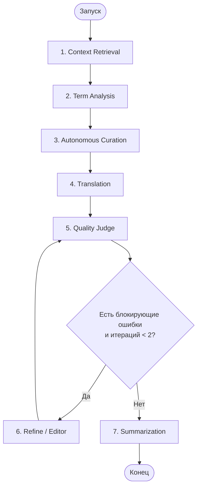
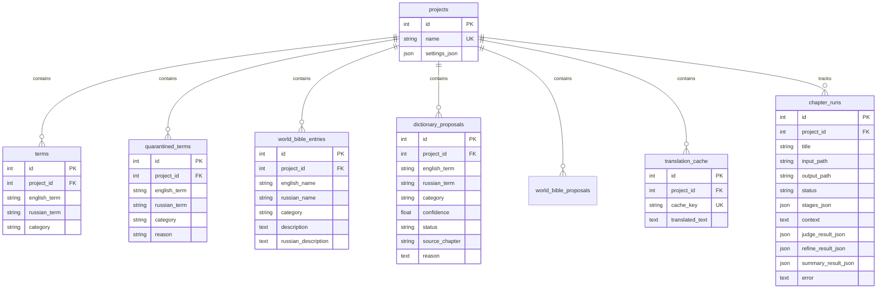

# Документация проекта: Переводчик Новелл (Perevod)

Данный документ содержит глубокий технический и архитектурный анализ проекта **«Переводчик Новелл» (Perevod)**. Он составлен в качестве исчерпывающего руководства для разработчиков (включая ИИ-агентов), которым предстоит поддерживать, дорабатывать или масштабировать систему.

---

## 1. Общее описание системы

**Переводчик Новелл** — это десктопное приложение (Python / CustomTkinter) для автоматизированного перевода глав новелл (преимущественно в жанре фэнтези) с английского языка на русский с использованием **Google Gemini API**.

### Ключевые возможности
*   **Сюжетная и терминологическая согласованность**: Интеграция базы знаний (World Bible / Lore) и глоссария через векторный поиск (RAG).
*   **Двухэтапный граф обработки (LangGraph)**: Автоматический анализ терминов, перевод, оценка качества (Judge) и итеративное исправление (Refine).
*   **Автоматическое расширение глоссария (Self-Learning)**: Судья выявляет синонимы, использованные переводчиком, и предлагает добавить их в словарь проекта.
*   **Надежность и возобновляемость (Resume & Retry)**: Сохранение чекпоинтов для каждой стадии обработки глав в SQLite. Возможность добрать незавершенные или упавшие главы без повторного расхода токенов на перевод.
*   **Контроль API-лимитов и бюджетов**: Локальный трекер квот и RPM-лимитер предотвращают блокировки аккаунта и хаотичные сбои из-за превышения лимитов.
*   **Локальное кэширование**: SQLite кэширует как готовые переводы (прошедшие QA), так и вычисленные эмбеддинги.

---

## 2. Архитектура и граф вычислений (LangGraph)

Логика перевода и постобработки организована в виде направленного графа состояний с помощью библиотеки **LangGraph**. Состояние графа описывается структурой [AgentState](file:///c:/Users/vanya/Desktop/kod/Perevod/src/Perevod/agents/state.py).

### Схема графа обработки



### Детальное описание узлов графа

1.  **Context Retrieval (`context_retrieval_node`)**
    *   **Файл**: [context_retrieval.py](file:///c:/Users/vanya/Desktop/kod/Perevod/src/Perevod/agents/nodes/context_retrieval.py)
    *   **Назначение**: Собирает лорный контекст (из World Bible) и краткую историю сюжета (Chapter Memory) для текущей главы.
    *   **Fallback**: Если семантический поиск ChromaDB падает (например, из-за сети), переключается на лексический поиск (Lexical Fallback) по всей локальной коллекции.

2.  **Term Analysis (`analysis_node`)**
    *   **Файл**: [analysis.py](file:///c:/Users/vanya/Desktop/kod/Perevod/src/Perevod/agents/nodes/analysis.py)
    *   **Назначение**: Сканирует исходный текст главы до перевода, извлекая новые именованные сущности (персонажей, локации, артефакты, техники) в формате JSON.
    *   **Оптимизация**: Результаты анализа кэшируются в SQLite по хэшу текста исходной главы.

3.  **Autonomous Curation (`autonomous_curation_node`)**
    *   **Файл**: [analysis.py](file:///c:/Users/vanya/Desktop/kod/Perevod/src/Perevod/agents/nodes/analysis.py)
    *   **Назначение**: Разрешает конфликты терминов. Если один и тот же английский термин получил разные варианты перевода в разных главах, curation-модель LLM выбирает каноничный вариант. Безальтернативные новые термины утверждаются автоматически.

4.  **Translation (`translation_node`)**
    *   **Файл**: [translation.py](file:///c:/Users/vanya/Desktop/kod/Perevod/src/Perevod/agents/nodes/translation.py)
    *   **Назначение**: Переводит главу. В промпт инжектируются: каноничный глоссарий проекта, RAG-контекст и стайлгайд новеллы.
    *   **Оптимизация под Gemma 4 31B**: При использовании `Gemma 4 31B` применяется усиленное следование глоссарию и генерация строгого XML-форматирования для стабильности вывода.
    *   **Чанкинг**: Если размер промпта превышает токен-бюджет (по умолчанию 120 000 токенов), глава автоматически разбивается на связанные части с сохранением контекста.
    *   **Атомарность**: Перед записью переведенного файла создается бэкап предыдущей версии (`.bak`).

5.  **Quality Judge (`judge_node`)**
    *   **Файл**: [judge.py](file:///c:/Users/vanya/Desktop/kod/Perevod/src/Perevod/agents/nodes/judge.py)
    *   **Назначение**: Проверяет перевод на полноту (отсутствие пропусков абзацев), соответствие глоссарию, гендерную согласованность, ИИ-клише и общую плавность.
    *   **Двухэтапная гибридная проверка (Stage 1 & Stage 2)**:
        *   **Stage 1 (Первичный)**: Быстрая и экономичная `gemini-3.1-flash-lite-preview` проводит начальный аудит перевода.
        *   **Stage 2 (Экспертный)**: Если Stage 1 выявил предупреждения или блокирующие ошибки, подключается экспертная `gemini-3.5-flash` для детального рецензирования и составления финального списка замечаний для этапа Refine.
    *   **Synonym Detection (Самообучение)**: Если переводчик использовал красивый синоним вместо жесткого словарного перевода, Judge одобряет его и вносит в SQLite как предложенного кандидата.
    *   **Интеграция кэша**: Только одобренные судьей переводы попадают в кэш перевода SQLite. В случае блокирующих ошибок существующий кэш для этой главы инвалидируется.

6.  **Refine / Editor (`refine_node`)**
    *   **Файл**: [refine.py](file:///c:/Users/vanya/Desktop/kod/Perevod/src/Perevod/agents/nodes/refine.py)
    *   **Назначение**: Принимает замечания судьи, исходный текст и текущий перевод, после чего генерирует исправленный вариант с помощью экспертной модели `gemini-3.5-flash`. Граф возвращает управление на стадию Judge. Допускается до 2 итераций исправления.

7.  **Summarization (`summarization_node`)**
    *   **Файл**: [summarization.py](file:///c:/Users/vanya/Desktop/kod/Perevod/src/Perevod/agents/nodes/summarization.py)
    *   **Назначение**: Создает краткий пересказ главы, выделяет ключевые события и активных персонажей. Сохраняет этот JSON в SQLite и векторный индекс ChromaDB как "воспоминание" для контекста последующих глав.

---

## 3. База данных и RAG (Хранение данных)

Система разделяет хранение данных на реляционное (SQLite) и векторное (ChromaDB).

### 3.1. Схема базы данных SQLite

Файл описания моделей: [models.py](file:///c:/Users/vanya/Desktop/kod/Perevod/src/Perevod/database/models.py). Менеджер запросов: [database_manager.py](file:///c:/Users/vanya/Desktop/kod/Perevod/src/Perevod/database/database_manager.py).



### 3.2. Векторное ядро ChromaDB и RAG
*   **Файл**: [knowledge_base_manager.py](file:///c:/Users/vanya/Desktop/kod/Perevod/src/Perevod/knowledge_base/knowledge_base_manager.py)
*   **Роль**: ChromaDB хранит векторные представления записей Библии и Глоссария, а также памяти о главах. Это временный поисковый индекс, который можно полностью и инкрементально перестроить на основе SQLite данных с помощью метода `rebuild_index_from_db`.
*   **Локальное кэширование эмбеддингов**: Для минимизации платных вызовов Gemini Embedding API (`gemini-embedding-2`) используется SQLite-таблица `embedding_cache.sqlite3`. Эмбеддинги кэшируются по хэшу текста и имени модели.
*   **Двухэтапный поиск**:
    1.  Извлечение кандидатов (по умолчанию `n_candidates = 25`) с помощью семантического сходства в ChromaDB.
    2.  Переранжирование кандидатов с помощью `Reranker` (по лексическому совпадению токенов и перекрытию слов) для выбора лучших `top_k = 7` результатов.

---

## 4. Сетевой шлюз (LLM Gateway) и контроль лимитов

Все обращения к API Gemini абстрагированы в модулях [llm_provider.py](file:///c:/Users/vanya/Desktop/kod/Perevod/src/Perevod/llm_provider.py) and [api_usage.py](file:///c:/Users/vanya/Desktop/kod/Perevod/src/Perevod/api_usage.py). Реестр моделей с их суточными лимитами описан в [model_registry.py](file:///c:/Users/vanya/Desktop/kod/Perevod/src/Perevod/config/model_registry.py).

### 4.1. Распределение моделей по ролям и лимитам
Для максимальной эффективности в рамках суточных лимитов Google API, роли распределены следующим образом:

| Роль в графе | Модель по умолчанию | Суточные квоты (RPD) | Минутный лимит (RPM) | Обоснование выбора |
| :--- | :--- | :--- | :--- | :--- |
| **Translation** | `gemma-4-31b-it` | 1500 RPD | 15 RPM | Большие лимиты на день, высокое качество перевода. |
| **Analysis / Curation** | `gemini-3.1-flash-lite-preview` | 500 RPD | 15 RPM | Экономичный разбор терминологии. |
| **Quality Judge (Stage 1)** | `gemini-3.1-flash-lite-preview` | 500 RPD | 15 RPM | Быстрый базовый аудит перевода. |
| **Expert Judge (Stage 2)** | `gemini-3.5-flash` | 20 RPD | 5 RPM | Глубокий анализ спорных моментов и ошибок. |
| **Refine / Editor** | `gemini-3.5-flash` | 20 RPD | 5 RPM | Качественная стилистическая правка. |
| **Summarization** | `gemini-3.1-flash-lite-preview` | 500 RPD | 15 RPM | Составление саммари и логов памяти. |

### 4.2. Локальный трекер лимитов и квот (`ApiUsageTracker`)
Предотвращает падение API из-за исчерпания дневных квот на бесплатных тарифах:
*   Перед вызовом API совершается атомарное бронирование слота в БД `api_usage.sqlite3` (`reserve_call`).
*   Если дневной лимит исчерпан, бронирование выбрасывает `ApiUsageLimitExceeded`, прерывая выполнение до отправки реального сетевого запроса.
*   При успехе транзакции бронь подтверждается (`record_call`), при ошибке сети — освобождается (`release_call`).
*   Зависшие брони автоматически очищаются по истечении TTL (1 час).

### 4.3. Адаптер моделей (`GeminiModelAdapter`)
*   **RPM Лимитер**: Выдерживает паузу между последовательными запросами к одной модели (например, `min_interval_seconds` равен 4 сек для Flash-Lite/Gemma и 12 сек для Flash), используя потокобезопасные блокировки (`threading.Lock`).
*   **Политика повторных попыток (Retry)**:
    *   *Повторяются с экспоненциальным backoff*: Сетевые сбои, таймауты, ошибки 500/502/503/504.
    *   *НЕ повторяются*: Ошибки аутентификации (401), отсутствия модели (404), превышения дневного лимита (429) и несоответствия схемы.
*   **Санитизация ошибок**: API-ключи автоматически вырезаются из текстов ошибок перед логированием или записью в отчет.

---

## 5. Инварианты надежности и механизмы возобновления (ADR)

Локальные инварианты надежности закреплены в [ADR-документе](file:///c:/Users/vanya/Desktop/kod/Perevod/docs/adr-2026-05-27-workflow-reliability-invariants.md):

*   **Блокировка папки вывода**: При запуске воркфлоу в целевой папке создается файл `.translation.lock` с указанием PID процесса. Параллельный запуск двух воркфлоу в одну папку запрещен.
*   **Авторитетность SQLite для стадий**: Чекпоинты глав (`ChapterRun`) в SQLite являются единственным доверенным источником состояния. Отчет `translation_report.json` генерируется на их основе для пользователя.
*   **Resume без перерасхода токенов**: При перезапуске воркфлоу с флагами `--retry-failed` или `--retry-incomplete` система проверяет состояние стадий в SQLite. Если перевод главы был успешно записан на диск, повторный вызов модели перевода блокируется — система переиспользует готовый файл и сразу переходит к Judge или Summarization.
*   **Изоляция контекста**: Контекст RAG и результаты проверки Judge уникальны для каждой главы и не могут повторно использоваться для других глав.
*   **Кэш только для QA-одобренных данных**: Запрещено помещать в кэш перевода сырые ответы LLM или промежуточные редакторские правки до тех пор, пока судья (Judge) не выдаст вердикт об успешном прохождении QA.

---

## 6. Локальная валидация качества перевода

Модуль [translation_quality.py](file:///c:/Users/vanya/Desktop/kod/Perevod/src/Perevod/utils/translation_quality.py) выполняет быстрые детерминированные проверки перевода на стороне клиента без вызова LLM:

*   **suspiciously short (truncation)**: проверка на потерю текста (если перевод короче 35% от оригинала при размере оригинала от 240 символов).
*   **latin ratio**: проверка на пропуск перевода (доля латиницы в тексте перевода не должна превышать 10%).
*   **missing required terms**: проверяет наличие обязательных терминов глоссария. Включает морфологический поиск основы слова (`_russian_term_occurs_in_text`) для учета падежей русского языка.
*   **AI slop detection**: предупреждает об использовании типичных шаблонных фраз искусственного интеллекта ("стоит отметить", "важно понимать" и др.).

---

## 7. Графический интерфейс (GUI)

Построен на базе **CustomTkinter** с использованием темной цветовой палитры «Space Dark» с HSL-свечением:
*   [main_window.py](file:///c:/Users/vanya/Desktop/kod/Perevod/src/Perevod/gui/main_window.py): Главное окно приложения. Позволяет настраивать проекты (пути ввода/вывода, выбор моделей, лимиты, стайлгайд) и запускать перевод во внешнем потоке с отслеживанием прогресса. Выводит детальный интерактивный отчет об ошибках.
*   [dictionary_editor.py](file:///c:/Users/vanya/Desktop/kod/Perevod/src/Perevod/gui/dictionary_editor.py): Пагинированный редактор глоссария с функциями поиска, добавления, удаления и объединения синонимичных терминов.
*   [bible_editor.py](file:///c:/Users/vanya/Desktop/kod/Perevod/src/Perevod/gui/bible_editor.py): Редактор записей лора (World Bible).
*   [quarantine_editor.py](file:///c:/Users/vanya/Desktop/kod/Perevod/src/Perevod/gui/quarantine_editor.py): Позволяет управлять конфликтными терминами, находящимися в карантине.

---

## 8. Памятка для ИИ-разработчика по доработке проекта

Если вам поручено доработать этот проект (добавить функции, изменить поведение графа или оптимизировать RAG), строго соблюдайте следующие правила:

### ⚠️ Архитектурные правила
1.  **Не импортируйте Google GenAI SDK напрямую в узлы графа**: Все вызовы должны идти через `generate_text()` из `Perevod.utils.llm` или адаптер `LLMProvider`.
2.  **Сохраняйте атомарность файловых операций**: Используйте временные файлы при записи критичных данных, делайте бэкапы.
3.  **Не удаляйте SQLite чекпоинты**: При любых рефакторингах графа сохраняйте инварианты возобновления работы (Resume) и соответствие таблице `chapter_runs`.
4.  **Только QA-одобренный кэш**: Никогда не пишите в кэш переводы, не прошедшие проверку судьи. Инвалидируйте кэш, если судья забраковал главу.
5.  **Соблюдайте стиль**: Используйте Unicode/UTF-8. Избегайте хрупких конструкций командной строки на Windows (используйте Python-скрипты вместо сложных cmd-цепочек).

### 🧪 Запуск тестов и проверок перед коммитом
Перед отправкой изменений обязательно выполните локальные проверки. Они не расходуют квоты Gemini API:

```bat
# 1. Проверка линтером ruff
python -m ruff check src scripts tests

# 2. Проверка компилируемости кода
python -m compileall -q src scripts

# 3. Запуск изолированных unit-тестов
python scripts\run_safe_tests.py

# 4. Запуск проверки тестового покрытия (Windows, Python 3.12)
python scripts\run_coverage.py
python -m coverage report -m
```

### 📈 Направления для развития (Бэклог)
Если пользователь просит улучшить переводчик, рассмотрите следующие улучшения:
*   **Улучшение кэширования RAG**: Добавление поддержки гибридного поиска (BM25 + Векторный) непосредственно в менеджер знаний.
*   **Расширение стайлгайдов**: Добавление поддержки кастомных промптов стилизации (style guide) отдельно для каждой новеллы через интерфейс GUI.
*   **Визуализация графа**: Внедрение интерактивной визуализации LangGraph в интерфейс CustomTkinter.
*   **Групповые операции в словаре**: Добавление пакетного импорта/экспорта глоссария в форматы CSV/XLSX.
